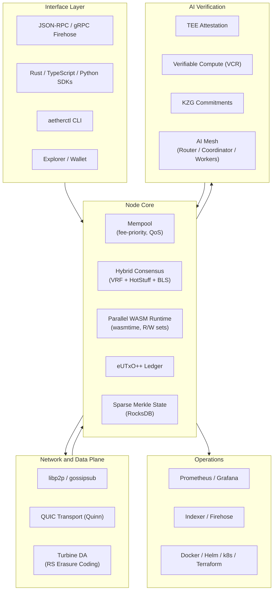

<div align="center">

# Aether

**A Rust-first L1 blockchain with AI-native verification, parallel WASM execution, and sub-2s finality.**

[](https://github.com/jadenfix/aether/actions/workflows/ci.yml)
[](LICENSE)
[](https://www.rust-lang.org)
[](crates/)
[](scripts/test.sh)

---

**Parallel Execution** &nbsp;&middot;&nbsp; **BFT Finality** &nbsp;&middot;&nbsp; **AI Verification** &nbsp;&middot;&nbsp; **Dual Token Economy**

</div>

---

## Why Aether?

Aether takes the best ideas from each generation of blockchains and combines them with AI-native infrastructure.

| | Bitcoin | Ethereum | Solana | **Aether** |
|---|---|---|---|---|
| **Execution** | Script | Serial EVM | Parallel SVM | **Parallel WASM** |
| **Finality** | ~60 min | ~15 min | ~12s | **< 2s** |
| **State Model** | UTXO | Account | Account | **eUTxO++** |
| **Consensus** | PoW | PoS (Casper) | PoH + Tower BFT | **VRF-PoS + HotStuff** |
| **Smart Contracts** | No | Solidity | Rust/C | **Rust/WASM** |
| **AI Native** | No | No | No | **TEE + VCR** |
| **Energy** | High | Low | Low | **Low** |

## Architecture



## Key Features

### Hybrid Consensus
VRF-based leader election, HotStuff BFT voting with 2-chain finality, and BLS aggregate signatures. Blocks finalize when >= 2/3 of stake commits.

### Parallel WASM Smart Contracts
Wasmtime-powered VM with read/write set analysis for automatic parallelization. Fuel metering, bounded memory, and sandboxed execution.

### eUTxO++ Ledger
Extended UTXO model combining Bitcoin's security properties with Ethereum's programmability. Deterministic fee estimation and natural parallelism.

### AI Verification Pipeline
End-to-end verifiable AI compute: jobs escrowed with AIC tokens, executed in TEEs, verified via VCR proofs with KZG polynomial commitments, and settled on-chain with challenge windows.

### Dual Token Economy
**SWR** for staking, governance, and validator rewards. **AIC** for AI compute credits, job escrow, and mesh worker payments. On-chain AMM for seamless exchange.

### On-Chain Programs
Staking, governance, AMM, job escrow, reputation scoring, AIC token, and account abstraction -- all built as native system programs.

### Turbine Data Availability
Reed-Solomon erasure-coded block propagation inspired by Solana's Turbine. Shred-based distribution for high throughput and fault tolerance.

### Full Observability
Prometheus metrics, Grafana dashboards, structured tracing spans, health check endpoints, and gRPC firehose for real-time indexing.

## Quick Start

**Prerequisites:** Rust 1.75+ &nbsp;|&nbsp; Docker (optional) &nbsp;|&nbsp; Node.js 20+ (optional, for web/SDKs)

```bash
git clone https://github.com/jadenfix/aether.git
cd aether
cargo build --workspace
cargo run -p aether-node
```

The node starts in devnet mode on `127.0.0.1:8545`. Query it:

```bash
curl -s http://127.0.0.1:8545 \
  -H 'Content-Type: application/json' \
  -d '{"jsonrpc":"2.0","method":"aeth_getSlotNumber","params":[],"id":1}'
```

### Run a Local Devnet (4 Validators)

```bash
./scripts/devnet.sh
```

### Run with Docker

```bash
docker compose -f docker-compose.test.yml up -d
```

### Devnet Ports

| Service | Ports |
|---|---|
| JSON-RPC (validators 1-4) | `8545` - `8548` |
| P2P Gossip (validators 1-4) | `9000` - `9003` |
| Prometheus Metrics | `9090` |
| Grafana Dashboard | `3000` |

## Project Structure

```
crates/                 47 Rust crates
  node/                 Validator binary (entry point)
  consensus/            VRF-PoS + HotStuff + BLS aggregation
  ledger/               eUTxO++ state transitions
  runtime/              WASM VM (wasmtime), parallel scheduler
  mempool/              Fee-priority tx pool, QoS
  p2p/                  libp2p networking
  networking/           QUIC transport (Quinn), gossipsub
  da/                   Turbine, erasure coding, shreds
  crypto/               Ed25519, VRF, BLS, KES, KZG
  state/                Sparse Merkle, RocksDB, snapshots
  programs/             Staking, governance, AMM, escrow, reputation
  verifiers/            TEE, KZG, VCR validators
  rpc/                  JSON-RPC, gRPC firehose
  types/                Shared types (Block, Transaction, Address)
  tools/                aetherctl, keytool, faucet, indexer, loadgen
ai-mesh/               Off-chain AI: router, coordinator, workers
sdks/                  TypeScript and Python SDKs
apps/                  Explorer and wallet
deploy/                Docker, Helm, k8s, Terraform, Prometheus, Grafana
scripts/               Lint, test, devnet, acceptance suites
fuzz/                  Libfuzzer targets (tx, block, merkle, VRF, WASM)
docs/                  Architecture, security, operations
```

## Development

```bash
cargo build --workspace                     # Debug build
cargo build --release                       # Release build
cargo test --all-features --workspace       # Run all 418+ tests
cargo clippy --all-targets --all-features -- -D warnings  # Lint
./scripts/lint.sh                           # Full CI lint flow
./scripts/test.sh                           # Full CI test flow
```

### CLI

```bash
cargo run -p aether-cli --bin aetherctl -- --help
```

## Documentation

| Document | Description |
|---|---|
| [Architecture](docs/architecture.md) | System design and component interactions |
| [Getting Started](GETTING_STARTED.md) | Contributor bootstrap and local workflows |
| [Contributing](CONTRIBUTING.md) | PR standards and validation flow |
| [Security](docs/security/AUDIT_SCOPE.md) | Audit scope and security model |
| [Runbooks](docs/ops/RUNBOOKS.md) | Operational procedures |
| [Roadmap](IMPLEMENTATION_ROADMAP.md) | Delivery plan and milestones |

## Contributing

Contributions are welcome across the entire stack -- protocol, tooling, AI mesh, frontend, and documentation. See [CONTRIBUTING.md](CONTRIBUTING.md) for guidelines.

## License

MIT License -- Copyright (c) 2026 Aether Foundation. See [LICENSE](LICENSE) for details.
