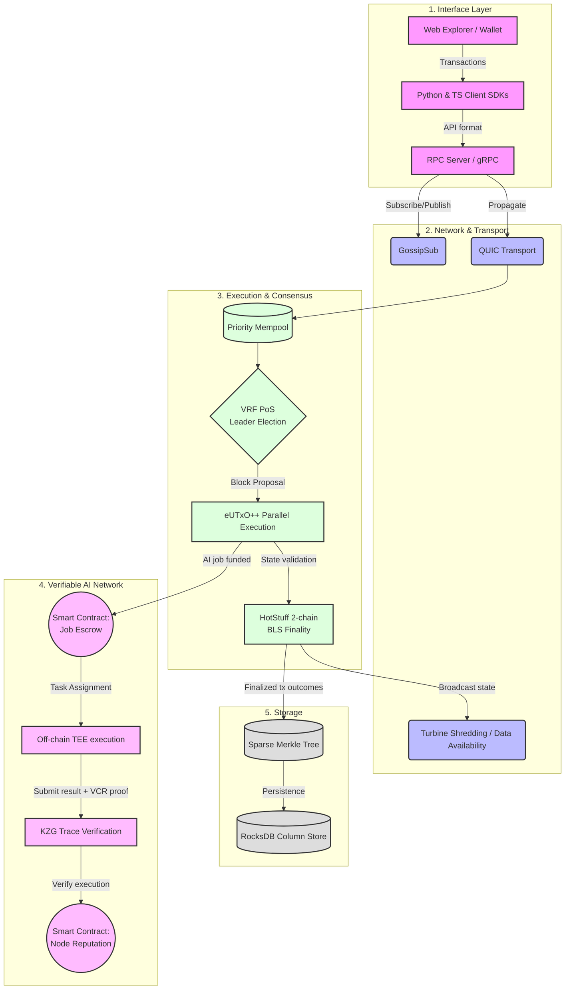

# Aether: The Open-Source AI Credits Superchain

> **Turn verifiable AI compute into programmable money.**  
> Aether is a community-driven, open-source blockchain project that fuses Solana-class performance with Cardano-grade security so builders can monetize intelligence at L1 speed. We are building the foundational infrastructure for a decentralized AI economy.

---

## Why Aether

- **Blazing Throughput** — QUIC transport, Turbine-style sharding, and batch crypto verification deliver >100k Ed25519 sig/s and 1.7k BLS verifications/s in acceptance tests.
- **Provable AI** — Native support for verifiable inference pipelines: VRF leader election, KZG trace challenges, secure TEE attestations, and programmable staking/reputation.
- **Security First** — Phase 6 security suite ships with full STRIDE/LINDDUN threat model, TLA+ consensus proofs, KES key rotation, and a remote signer architecture fit for HSM/KMS.
- **Production Observability** — Prometheus metrics, Grafana-ready dashboards, alerting rules, and per-phase acceptance suites wired straight into CI.
- **Developer Velocity** — Modular Rust workspace (47+ crates), clean APIs, and ready-to-run scripts for every phase of the roadmap.

---

## Product Pillars

### 1. High-Performance Ledger
- eUTxO++ hybrid state model with Sparse Merkle commitments
- Fee-prioritized mempool with RBF and QoS scheduling
- RocksDB storage tuned for high-write, low-latency workloads

### 2. Secure Consensus
- VRF-driven leader election (Ed25519 + VRF proofs)
- HotStuff-inspired finality with BLS aggregation
- Comprehensive slashing protection via remote signer design

### 3. Verifiable AI Mesh
- Deterministic containers for reproducible inference
- TEE attestation pipeline (SEV-SNP / TDX simulation)
- KZG-backed trace commitments and challenge flows
- Reputation and staking programs purpose-built for AI providers

### 4. Observability & Automation
- Metrics for consensus, DA, networking, runtime, and AI jobs
- Alert rules covering finality, throughput, packet loss, and peer health
- CI matrix that enforces lint + acceptance suites for Phases 1–6

---

## Proof It Works

| Phase | Acceptance Highlights | Script |
|-------|----------------------|--------|
| 1 | Ledger, consensus, and mempool unit suites | `./scripts/run_phase1_acceptance.sh` |
| 2 | Economics & system programs (staking, AMM, AIC, job escrow) | `./scripts/run_phase2_acceptance.sh` |
| 3 | AI mesh stack (runtime, TEE, VCR, KZG, reputation) | `./scripts/run_phase3_acceptance.sh` |
| 4 | Performance benches (Ed25519, BLS, Turbine, snapshots) | `./scripts/run_phase4_acceptance.sh` |
| 5 | Metrics exporter + QUIC instrumentation | `./scripts/run_phase5_acceptance.sh` |
| 6 | Security primitives (KES, crypto suites, VRF) | `./scripts/run_phase6_acceptance.sh` |
| 7 | SDK + CLI + explorer/wallet + faucet tooling | `./scripts/run_phase7_acceptance.sh` |

GitHub Actions fans out across all seven suites to keep every subsystem green.

---

## Build the Future

```bash
# Clone
git clone https://github.com/jadenfix/deets.git
cd deets

# Fast sanity checks
cargo fmt --all -- --check
cargo clippy --all-targets --all-features -- -D warnings
./scripts/run_phase4_acceptance.sh   # performance snapshot

# Run a node
cargo run --release --bin aether-node
```

### Quick CLI Commands

```bash
# Lint/format/check in parallel
./cli-format

# Balanced test run (Rust + JS/TS lanes)
./cli-test

# Rust-only test mode
./cli-test --rust-only

# Devnet docker stack (default target)
./cli-build
./cli-up
./cli-down

# Test docker stack
./cli-build --test
./cli-up --test
./cli-down --test --volumes
```

| Command | Purpose | Useful Flags |
|---------|---------|--------------|
| `./cli-test` | Runs Rust test suite and JS/TS tests, with lanes in parallel. | `--rust-only`, `--no-doc` |
| `./cli-format` | Runs `fmt`, `clippy`, and `check` in parallel lanes. | `--help` |
| `./cli-build` | Builds Docker images for compose stack. | `--test` |
| `./cli-up` | Starts compose stack with `up --build -d`. | `--test` |
| `./cli-down` | Stops compose stack with `down`. | `--test`, `--volumes` |

Need data availability or AI job telemetry? Export Prometheus metrics instantly:

```bash
cargo run -p aether-metrics
# -> visit http://localhost:9090/metrics
```

---

## Architecture at a Glance



Dive deeper in:
- [`overview.md`](./overview.md) – architecture narrative  
- [`trm.md`](./trm.md) – seven-phase technical roadmap  
- [`docs/security/REMOTE_SIGNER.md`](./docs/security/REMOTE_SIGNER.md) – hardened key management

---

## Roadmap

- **Phase 7 – Developer Ecosystem**: TypeScript/Python SDKs, wallet integrations, launchpad tooling
- **Mainnet Readiness**: Formal audits, fuzzing campaigns, comprehensive slashing protection
- **AI Marketplace**: On-chain order books for inference jobs, SLA-backed payment channels

Stay tuned on our community channels (coming soon) to capture devnet access and validator slots the moment they open.

---

## Open Source community & Contributing

Aether is proudly **open-source** and thrives on community contributions. Whether you are a Rust systems engineer, a cryptography researcher, a TypeScript UI developer, or an enthusiast writing documentation, there is a place for you here.

- **Found a bug?** Open an issue to let us know.
- **Have an idea?** Start a discussion or open a PR.
- **Want to help?** Look for issues labeled `good first issue` or `help wanted`.

Please see our [CONTRIBUTING.md](./CONTRIBUTING.md) for more details on our codebase structure, how we review PRs, and our community code of conduct.

---

## License

MIT License – Build, fork, and deploy with confidence. See the [LICENSE](./LICENSE) file for more details.
